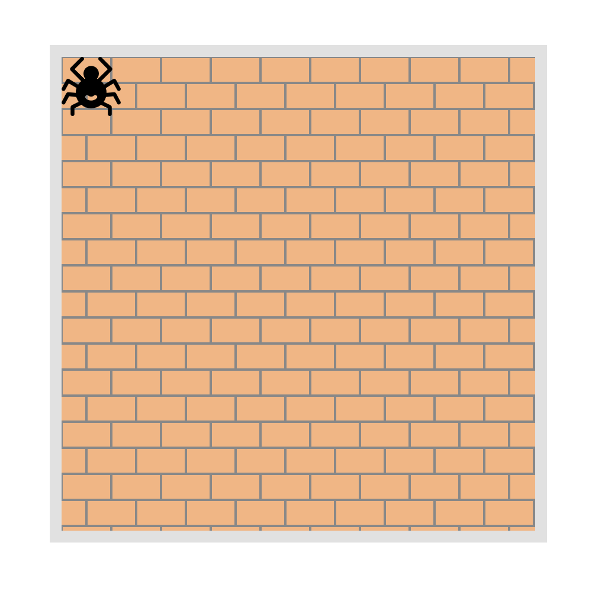
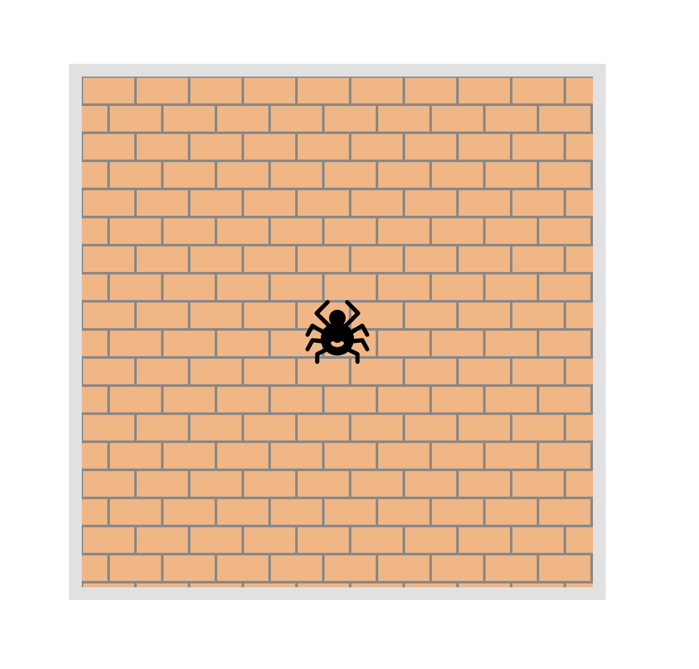

Follow [this instruction](https://github.com/mate-academy/layout_task-guideline/blob/master/README.md) to solve task

### Task: Center the spider

Your task: Center the spider using only JavaScript. Yes, it task can be easily done with pure CSS, but not now. Do it with JS.

You no need to write any styles or HTML code in this task. Change only `main.js` file.

Hints: 
- Field has `wall` class.
- Spider image has `spide` class.

It's an expected result of your job:

